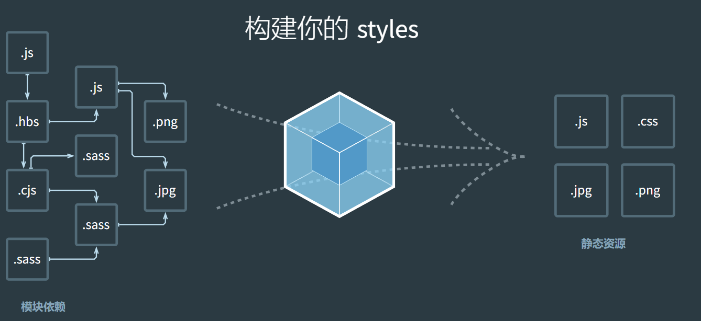

# [概念](https://webpack.docschina.org/concepts)

本质上，**webpack** 是一个用于现代 JavaScript 应用程序的 *静态模块打包工具*

它会在内部从一个或多个入口点构建一个 [依赖图(dependency graph)](https://webpack.docschina.org/concepts/dependency-graph/)，然后将你项目中所需的每一个模块组合成一个或多个 *bundles*，它们均为静态资源，用于展示你的内容。